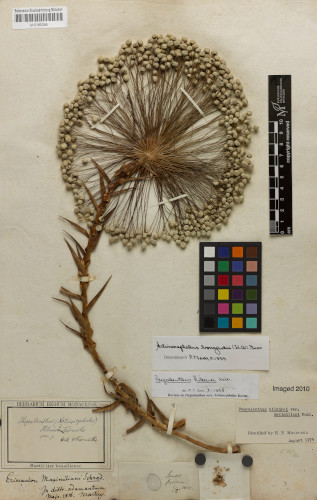

Botanical collections of plantae, fungi and lichens are a humongous treasure of biodiversity knowledge stored in many museums and institutions throughout Germany. They’ve been compiled by botanists in the past centuries and continue to grow nowadays and are a valuably testimony the botanical wildlife in the past and the present, of species that can still be found or that have become extinct.

<figure class="has-text-centered">
	<a href="/data?entity=2981268752&filter=eyJtdXN0Ijp7InRheG9uS2V5IjpbNTI4NzQyNV19fQ&view=TABLE">
		
		<figcaption>Actinocephalus bongardii (A.St.-Hil.) Sano</figcaption>
	</a>
</figure>
 
The objects to be found in these collections are called specimens and are very diverse, ranging from dried plants mounted on herbarium sheets or kept in envelopes, algae), living collections of botanical gardens and seed banks, DNA and tissue collections, specimens preserved in fluids, wood, fruit, seed, fibre, and pollen collections, as well as micro-preparations on microscope slides. 

{:standalone .has-text-centered}

These specimens are a valuable source of information and material for today’s biological research, for example for getting a better understanding of past and ongoing changes (and losses) of our biodiversity, for biodiversity modelling and conservation planning. They can be the starting point for automated image recognition by artificial intelligence, thus enabling provenance research as well as education, outreach and citizen science.

{:standalone .has-text-centered}

Yet, most of them remain hidden in vaults and are invisible to the general public; only a few objects become exhibits in museums. The Virtual Herbarium aims at overcoming this constraint by enabling an easy discovery of the digitised specimens of German botanical collections. It can be used by both scientists to find specimens of interest based on a multitude of search criteria and by a wider audience through simple [browsing of records](/data) or [digital images](/data?view=GALLERY).

The 70 herbaria in Germany house an estimated 22.2 million specimens, about 6% of the specimens worldwide and 13% of the specimens stored in European herbaria. Depending on the type of specimen (flat specimen mounted on cardboard sheet versus three-dimensional objects stored in boxes) the effort for digitisation is immense, so only a small portion is accessible online.

[Browse list](/data?view=TABLE){: .button .is-primary} [Explore in map](/data?view=MAP){: .button} [View images](/data?view=GALLERY){: .button}
{: .has-text-centered}

Currently 787,000 records can be browsed in the Virtual Herbarium Germany, of which xx come with high-resolution images that allow for an in-depth study of the original specimen. The data accessible stem from [xx collections provided by xx museums, botanical gardens or universities](/data?view=DATASETS) and cover botanical specimens from all over the world.

<figure class="has-text-centered">
	<a href="/data?view=MAP">
		
		<figcaption>Provenance of geo-referenced digital specimens of the German Virtual Herbarium</figcaption>
	</a>
</figure>