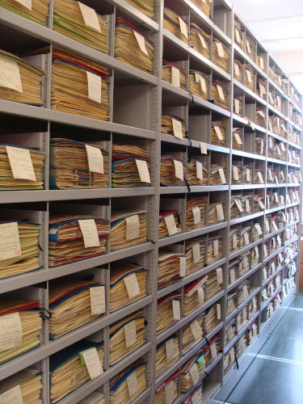
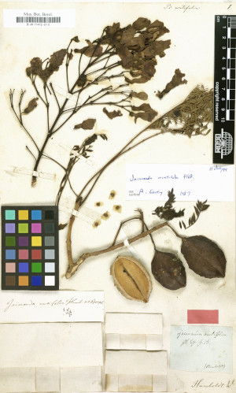
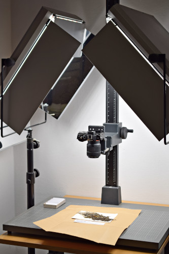

In Deutschland lagern in 70 Herbarien mehr als 22 Millionen Belegexemplare, das sind etwa 6% der Belege weltweit und 13% der Belege in Europa: 53% sind auf Pappbögen montierte Objekte (meist Samenpflanzen, Farne, Bärlappe, Makroalgen), weitere 21% sind noch nicht montiert. 26 % werden in ander Form aufbewahrt, z. B. in Boxen, in Umschlägen, auf Dias oder in Flüssigkeiten (vor allem Moose, Flechten, Pilze und Algen).

{:standalone .has-text-centered}

Lediglich 13% der in deutschen Herbarien aufbewahrten Belege sind bisher digitalisiert worden; 69% dieser digitalen Belege umfassen nur Textdaten (Etiketteninformationen), während 31% ein oder mehrere Bilder enthalten. Durchschnittlich werden 48.000 Belege pro Jahr digitalisiert, was bei etwa 200.000 Neuzugängen pro Jahr bedeutet, dass die Digitalisierungsrate derzeit rückläufig ist.

<figure class="has-text-centered">
	<a href="/de/data?entity=864884844&filter=eyJtdXN0Ijp7InRheG9uS2V5IjpbNDA5MTE1MF19fQ&view=TABLE">
		
		<figcaption>Herbariumsscan von Bignonia acutiflora Mart. ex DC.</figcaption>
	</a>
</figure>

Die Steigerung des Digitalisierungsgrades hat eine Vielzahl von Vorteilen sowohl für die Wissenschaft als auch für die breite Öffentlichkeit:
* Belegexemplare, die normalerweise in Depots aufbewahrt werden, werden für die Allgemeinheit zugänglich gemacht und können für Forschung, Lehre und akademische Ausbildung genutzt werden.
* Citizen-Science-Projekte wie [Les herbonautes (fr)](http://lesherbonautes.mnhn.fr/) und [Die Herbonauten (de)](https://herbonauten.de/) können mit Hilfe von Crowdsourcing-Ansätzen Metadaten von den Etiketten, die an den Belegen angebracht sind, erfassen und so den Informationsgehalt und die Nutzbarkeit der Belege erhöhen und gleichzeitig das Interesse der Öffentlichkeit an diesen einzigartigen Objekten wecken.
* Hochaufgelöste Bilder ermöglichen eine genaue Erforschung der Belege ohne physischen Zugang zu den Sammlungen, so dass persönliche Reisen oder der potentiell riskante Versand von Belegen per Post entfallen.
* Durch die Anbindung der digitalen Belege an Biodiversitätsdatennetze wie [GBIF](https://www.gbif.org/), [BioCASe](https://www.biocase.org/) und [DiSSCo](https://www.dissco.eu/) werden sie für Forscher weltweit auffind- und nutzbar. Dies geht über die Arbeit mit einzelnen Belegen hinaus und umfasst auch datenbankübergreifende Analysen wie die Modellierung der biologischen Vielfalt und die Vorhersage der Bedrohung durch invasive Arten.
* Die Sichtbarkeit von Herbarien in der Öffentlichkeit ist im Vergleich zu Sammlungen aus anderen Bereichen relativ gering. Durch die Einstellung von naturkundlichen Belegen in kulturelle Datenportale wie Europeana, die europäische digitale Bibliothek, kann das Bewusstsein dafür geschärft werden, dass auch [diese Art von Sammlungen](https://classic.europeana.eu/portal/de/search?f%5BPROVIDER%5D%5B%5D=OpenUp!&view=grid) Teil des kulturellen Erbes sind.

Drei von vier Objekten in deutschen Herbarien sind auf Karton montierte Exemplare (einschließlich der noch unmontierten Belege). Im Vergleich zu anderen naturkundlichen Sammlungen sind solche flachen Herbarblätter relativ einfach mit Digitalkameras, Scannern und Mikroskopen zu digitalisieren. Allerdings erlaubt die derzeit in deutschen Institutionen vorhandene Ausstattung nur einen mäßigen Digitalisierungsdurchsatz.

{:standalone .has-text-centered}

Erfolgreiche Digitalisierungsinitiativen in anderen Ländern wie den Niederlanden, Frankreich und Finnland haben Hochdurchsatz-Digitalisierungsmethoden mit Fließbandtechnik im industriellen Maßstab eingesetzt, um Millionen von Belegen zu digitalisieren. Ihre Erfahrungen zeigen, dass ganze Herbarien dank ausgefeilter Arbeitsabläufe und Verfahren in relativ kurzer Zeit vollständig und kosteneffizient digitalisiert werden können.

Aus diesem Grund haben 51 Vertreter aus 30 Institutionen einen Aufruf zur Erhöhung des Digitalisierungsgrades durch den Beginn einer durchgehenden Digitalisierung der in deutschen Herbarien gelagerten flachen Objekte initiiert. Weitere Details zu diesem Aufruf und einen umfassenden Überblick über die Situation in deutschen Herbarien sind in diesem Positionspapier zu finden:

[Aufruf für eine vollständige Digitalisierung der deutschen Herbarien](https://riojournal.com/article/50675/){: .button .is-primary}
{: .has-text-centered}