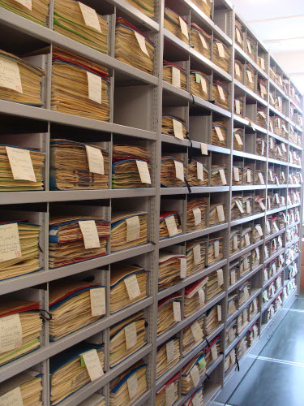
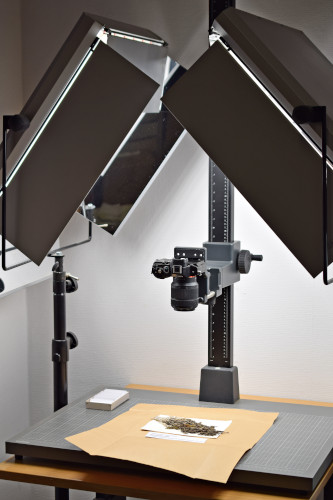

In Germany, 70 herbaria store more than 22 million specimens, about 6% of the specimens worldwide and 13% of the specimens in Europe: 53% are objects mounted on stiff paper sheets (mostly seed plants, ferns, lycophytes, macroalgae), another 21% are not mounted yet, and 26% are stored in other forms, such as in boxes, in envelopes, on slides, or in liquids (mostly bryophytes, lichens, fungi, and algae).

{:standalone .has-text-centered}

Only 13% of the specimens held in German herbaria have been digitised so far; 69% of those digital specimens comprise only textual data (label information), whereas 31% include one or several images. An average of 48,000 specimens are digitised per year; given the figure of about 200,000 accessions per year, this implies that the proportion of digitised specimens is decreasing over time.

<figure class="has-text-centered">
	<a href="/data?entity=864884844&filter=eyJtdXN0Ijp7InRheG9uS2V5IjpbNDA5MTE1MF19fQ&view=TABLE">
		
		<figcaption>Herbarium scan of Bignonia acutiflora Mart. ex DC.</figcaption>
	</a>
</figure>

Increasing the level of digitisation has a multitude of benefits for both science and the wider public audience: 
* Specimens usually locked away in vaults become accessible and usable for research, teaching and academic education.
* Citizen science projects like [Les herbonautes (fr)](http://lesherbonautes.mnhn.fr/) and [Die Herbonauten (de)](https://herbonauten.de/) can use crowdsourcing approaches to capture metadata from labels attached to the specimens, thus increasing their richness and discoverability and at the same time the engagement of the public with these fascinating objects.
* High-resolution images allow an in-depth scrutiny of specimens without physical access to the physical collections, eliminating the need for personal travel or potential damaging shipping of specimens by mail.
* By connecting the digital specimens to biodiversity data networks like [GBIF](https://www.gbif.org/), [BioCASe](https://www.biocase.org/) and [DiSSCo](https://www.dissco.eu/), they become findable and usable for researchers worldwide. This goes beyond the work with individual specimens and also includes cross-dataset analyses like biodiversity modelling and invasive species threat prediction.
* The visibility of herbaria in the public domain is relatively low, compared to other types of collections. By feeding natural history specimens into cultural data portals like Europeana, the European digital library, the awareness for these [types of collections being part of our cultural heritage](https://www.europeana.eu/en/search?qf=PROVIDER%3A%22OpenUp%5C%21%22) can be increased.

Three of four objects in German herbaria are paper-mounted specimens (or those yet unmounted). Compared to other natural history collections, these flat herbarium sheets are relatively easy to digitise by using digital cameras, scanners and microscopes. However, the equipment currently available in German institutions allows only for a moderate throughput.

{:standalone .has-text-centered}

Successful digitisation initiatives in other countries like the Netherlands, France and Finland have used high-throughput digitisation methods using conveyor belts on an industrial scale to digitise millions of specimens. Their experiences show that whole herbaria can be comprehensively and cost-efficiently digitised in a relatively short time due to established workflows and protocols.

For this reason, an appeal to increase the level of digitisation by starting a wall-to-wall digitisation of the flat objects stored in German herbaria has been initiated by 51 representatives from 30 institutions. See this article for more details and a complete survey of the situation in German herbaria:

[View the call for a complete digitsation of German herbaria](https://riojournal.com/article/50675/){: .button .is-primary}
{: .has-text-centered}